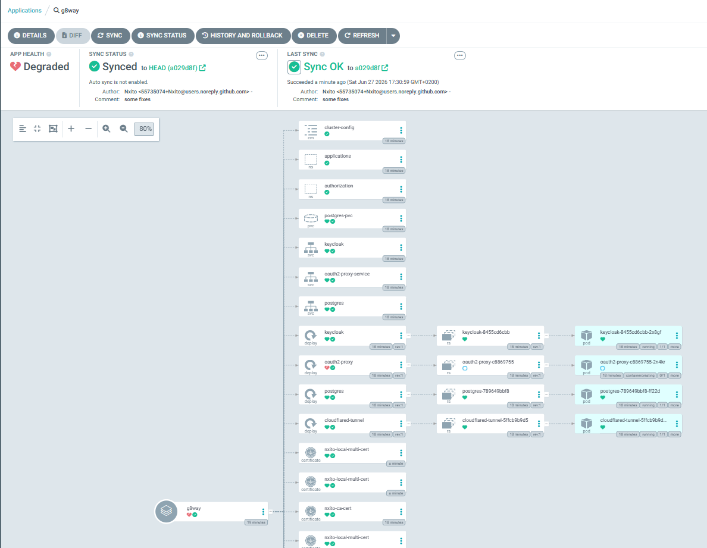

# g8way
Deploy with ArgoCD a k8s api-gateway solution with traefik, certmanager, keycloak and more.



> Al momento de este commit, estoy usando externamente un pihole y hashicorp vault en docker.
> El motivo: de momento no creo que sean partes que deban ir a nivel de máquinas / cluster.

---

## Paso 0 — Prerequisitos

Necesitas un cluster de Kubernetes operativo. Este proyecto está probado con:
- **MicroK8s** (para homelab)
- **Docker Desktop** (para pruebas locales)

Antes de arrancar ArgoCD, ejecuta el script de bootstrap para instalar los CRDs e infraestructura base:

```bash
# Linux / MicroK8s
scripts/bootstrap.sh

# Windows
scripts/bootstrap.bat
```

Esto instalará en orden:
- Gateway API CRDs
- MetalLB
- cert-manager + trust-manager
- Traefik
- External Secrets Operator

---

## Paso 1 — ArgoCD

Instala ArgoCD en el cluster. Tienes los pasos detallados en `apps/_argocd/readme.md`.

```bash
kubectl create namespace argocd
helm repo add argo https://argoproj.github.io/argo-helm
helm repo update
helm install argocd argo/argo-cd -n argocd -f apps/_argocd/values.yaml
```

Recuperar contraseña inicial:

```bash
# Linux
kubectl get secret argocd-initial-admin-secret -n argocd \
  -o jsonpath="{.data.password}" | base64 -d

# Windows PowerShell
$b64 = kubectl get secret argocd-initial-admin-secret -n argocd -o jsonpath="{.data.password}"
[System.Text.Encoding]::UTF8.GetString([System.Convert]::FromBase64String($b64))
```

Accede a la UI en `http://localhost:8080` con port-forward:

```bash
kubectl port-forward svc/argocd-server -n argocd 8080:80
```

---

## Paso 2 — Hashicorp Vault

Necesitarás una bóveda para mantener seguros los secrets. Yo prefiero que mis secretos sean solo míos y como tampoco me gusta pagar a terceros para entornos personales, opté por Hashicorp Vault localmente.

Puedes usar AWS Secrets Manager o Azure Key Vault a nivel empresarial.

Está preparado un docker compose en `external/hashicorp-vault`. Levántalo con:

```bash
docker compose up -d
```

> **Importante:** Genera tus propios certificados TLS para Vault. Los que vienen son de ejemplo.
> Vault requiere **unseal manual** cada vez que se reinicia.

### Estructura de secrets en Vault

Crea los siguientes paths en la UI de Vault (`Secrets` → `secret` → `Create secret`):

| Path | Claves |
|------|--------|
| `cloudflare/tunnel` | `token` |
| `oauth2-proxy` | `client-id`, `client-secret`, `cookie-secret` |
| `keycloak/db` | `username`, `password`, `database` |
| `keycloak/admin` | `username`, `password` |
| `github` | `token` |

> Los valores deben estar en **texto plano**, sin base64.

> El `cookie-secret` de oauth2-proxy debe tener exactamente 16, 24 o 32 bytes:
> ```bash
> openssl rand -base64 16
> ```

---

## Paso 3 — External Secrets Operator

Conecta el cluster con Vault para que los secrets se sincronicen automáticamente.

### 3.1 Crear el token de Vault

En la UI de Vault: `Access` → `Tokens` → crear token con política de lectura sobre `secret/`.

```bash
kubectl create secret generic vault-token \
  --from-literal=token="TUTOKEN" \
  -n external-secrets
```

### 3.2 Añadir el CA de Vault

```bash
kubectl create secret generic vault-ca \
  --from-file=ca.crt=external/hashicorp-vault/certs/vault.crt \
  -n external-secrets
```

### 3.3 Crear el ClusterSecretStore

Guarda esto en un archivo y aplícalo:

```yaml
apiVersion: external-secrets.io/v1
kind: ClusterSecretStore
metadata:
  name: vault-backend
spec:
  provider:
    vault:
      server: "https://TU_IP_VAULT:8200"
      path: "secret"
      version: "v2"
      caProvider:
        type: Secret
        name: vault-ca
        namespace: external-secrets
        key: ca.crt
      auth:
        tokenSecretRef:
          name: vault-token
          namespace: external-secrets
          key: token
```

```bash
kubectl apply -f cluster-secret-store.yaml
kubectl get clustersecretstore vault-backend
```

El estado debe ser `Valid` y `Ready: True`.

### 3.4 Verificar sincronización

```bash
kubectl get externalsecret -A
```

Todos deben mostrar `SecretSynced`.

---

## Paso 4 — Red y DNS

Yo uso Tailscale y Pi-hole para dar nombres fijos a mis rutas. De esta forma toda mi red tiene acceso a mis apps de administración pero nadie externamente puede tocarlas.

Tienes un docker compose preparado en `external/pi-hole`.

Con Pi-hole configuras entradas DNS locales apuntando a la IP de MetalLB (`192.168.50.200`) para tus dominios `*.nxito.local`.

---

## Paso 5 — Desplegar con ArgoCD

Conecta tu repo en ArgoCD:

`Settings` → `Repositories` → `Connect Repo` → HTTPS → introduce tu URL y Personal Access Token de GitHub.

El token necesita permisos:
- `Contents`: Read-only
- `Metadata`: Read-only

Crea la Application apuntando a `config/`:

`New App` → Path: `config` → `Directory Recurse: true` → `Sync: Automatic`

ArgoCD desplegará todo el contenido de `config/` recursivamente.

Opcionalmente tienes un ejemplo de la configuracion en nxito-g8way-argocd.yaml
---

## Orden de arranque

Cada vez que reinicias el entorno:

1. Vault up + unseal
2. Cluster listo
3. ArgoCD operativo
4. External Secrets sincroniza contra Vault
5. Apps disponibles
